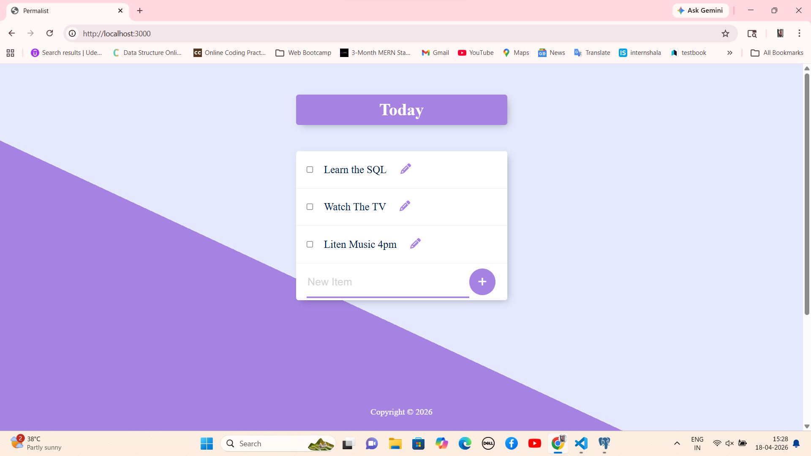

# 📝 Permalist Project

A simple **To-Do List (Permalist)** web application built using **Node.js, Express, PostgreSQL, and EJS**.  
This project is created as part of the Udemy course to understand backend development and database integration.

---

## 🚀 Features

- Add new tasks
- Delete tasks
- Store tasks in PostgreSQL database
- Dynamic rendering using EJS
- Clean and simple UI

---

## 🛠️ Tech Stack

- Node.js
- Express.js
- PostgreSQL
- EJS (Embedded JavaScript Templates)
- HTML, CSS

---

## 📂 Project Structure

```
Permalist Project/
│── node_modules/
│── public/
│── views/
│   ├── partials/
│   │   ├── header.ejs
│   │   ├── footer.ejs
│   ├── index.ejs
│── index.js
│── package.json
│── queries.sql
```

---

## ⚙️ Installation & Setup

1. Clone the repository:
```bash
git clone https://github.com/Prarthanabhandari/Permalist
```

2. Navigate to project folder:
```bash
cd permalist-project
```

3. Install dependencies:
```bash
npm install
```

4. Start the server:
```bash
nodemon index.js
```

5. Open in browser:
```
http://localhost:3000
```

---

## 🗄️ Database Setup

- Create a PostgreSQL database named:
```
permalist
```

- Run the SQL queries from `queries.sql` file.

---

## 📸 Project Screenshots

### 🔹 Home Page


### 🔹 Add Task


### 🔹 Delete Task


---

## 📌 Future Improvements

- User authentication (Login/Register)
- Edit tasks feature
- Categories for tasks
- Better UI design

---

## 🙋‍♀️ Author

**Prarthana Bhandari**  
MCA Student | Backend Developer Learner

---

## ⭐ Show Your Support

If you like this project, give it a ⭐ on GitHub!
